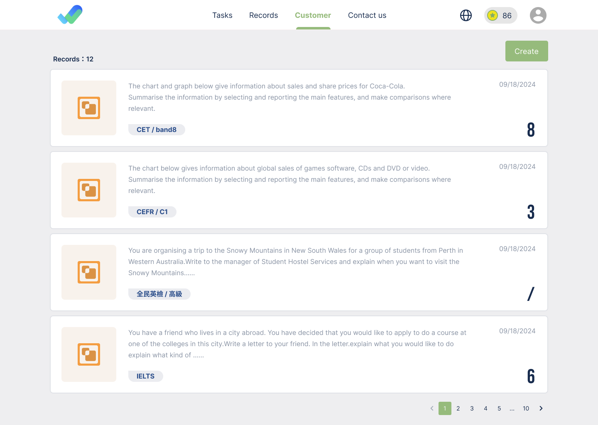
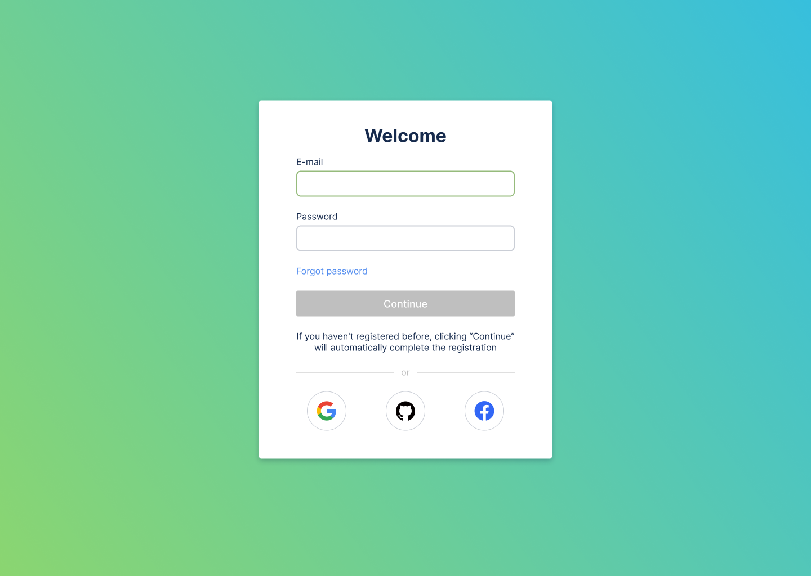
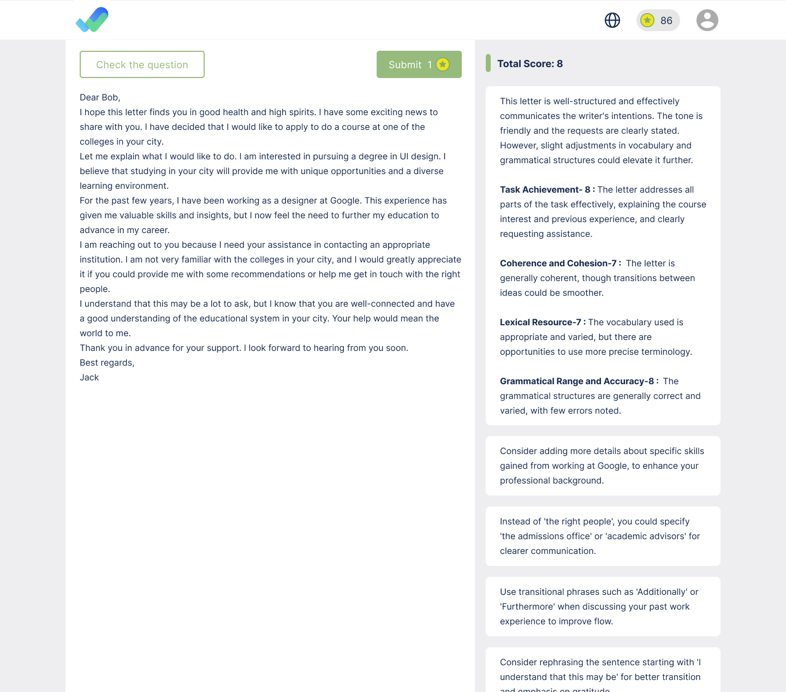
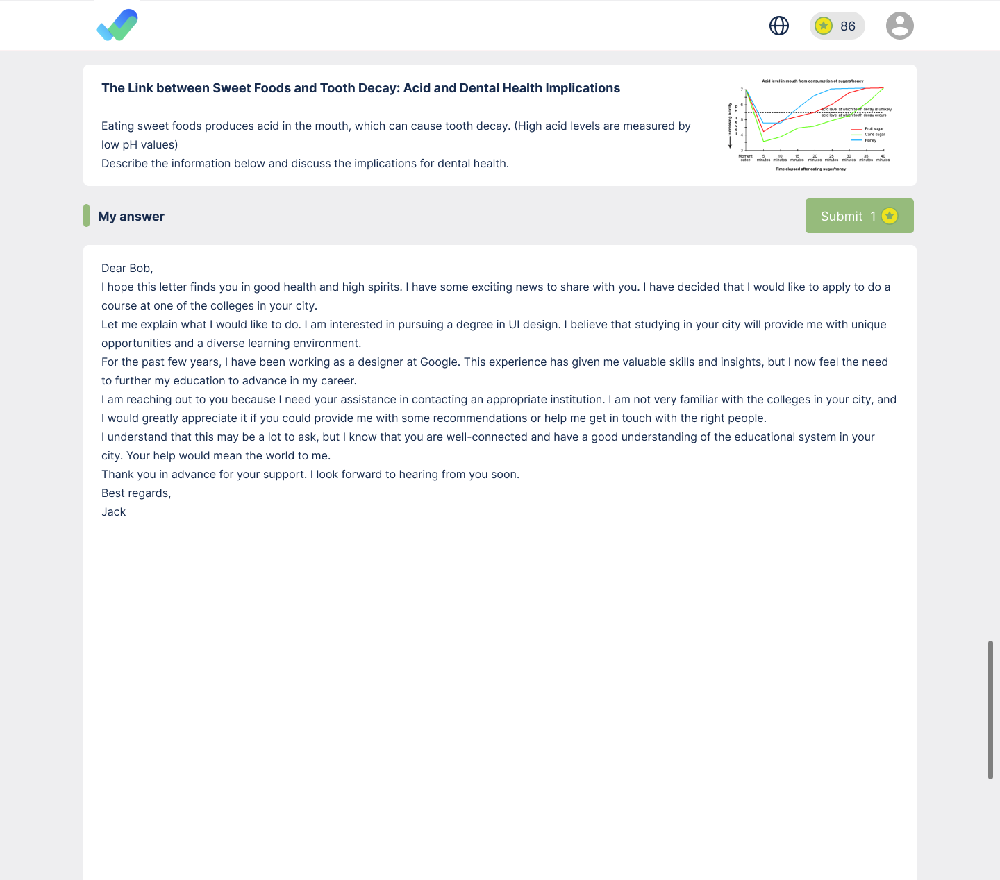
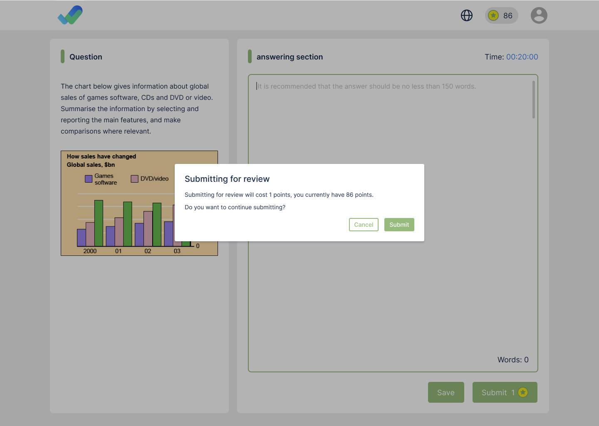
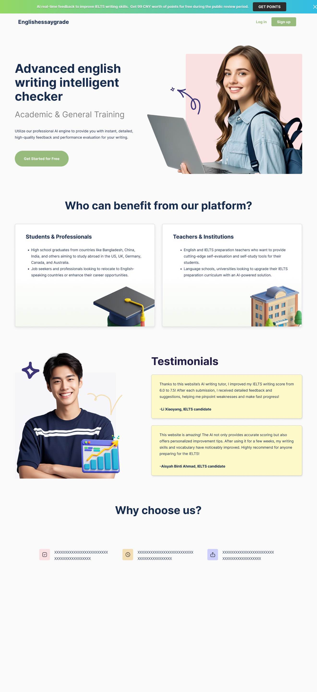

## IELTS Writing Auto-Correction System Based on Next.js + App Router

### Features:
- AI writing correction based on OpenAI, applicable not only to IELTS but also to other English subjects.
- By modifying the prompt, it can also support writing correction in other languages.
- Supports built-in topics and user-customized topics.
- Supports user login and saves correction records.
- Supports OCR (based on OpenAI).
- Supports fee management (points are deducted for each correction).
- Multi-language support.

### Usage:
1. Install MySQL and set the username and password (default is root/123456).
2. Run `npm install`.
3. Run `npx prisma migrate deploy`.
4. Fill in the corresponding authentication account in `.env.production` (OpenAI is required; if not using one-click login, Google/GitHub/Apple accounts can be left blank).
5. Run `npm run build:production`.
6. Run `npm run start`.

### Issues:
- The multi-language implementation relies on cookies, causing the page to be unable to use SSR and SSG (though this isn't entirely a bad thing).
- OCR performance is not ideal for poorly written text with OpenAI.
- The App Router version of Next introduces too many concepts, making development and maintenance more complex and prone to errors compared to the Page Router.

## 基于Next.js + app router 构建的雅思写作自动批改系统

### 功能
- 基于OpenAI实现AI 写作批改，除雅思外其他类型的英文科目也可以实现。
- 修改prompt后，同样也可以实现其他语种的作文批改。
- 支持内置题目和用户自定义题目。
- 支持用户登录，保存批改记录。
- 支持OCR（基于OpenAI实现）。
- 支持费用管理（每次批改扣除相应的点数）。
- 支持多语言。

### 使用
1. 安装mysql，设置账号密码（默认为root/123456）
2. npm install
3. npx prisma migrate deploy
4. 在.env.production中填入对应的鉴权账号(OpenAI 为必须，如果不用到一键登录，可以不填写google/github和apple等账号)
5. npm run build:production
6. npm run start

### 问题
- 多语言的实现方案依赖cookie，导致页面无法使用ssr和ssg（这并不全是坏事）。
- OpenAI对于书写不工整的文本，OCR效果并不理想。
- app router版本的next引入了过多的概念，相比page router开发和维护都变得更加复杂，更易出问题。
- 
## Next.js + App Router を基盤にした IELTS ライティング自動採点システム

### 機能:
- OpenAI に基づいた AI ライティング採点、IELTS だけでなく、他の英語科目にも対応。
- プロンプトを変更することで、他の言語のライティング採点もサポート可能。
- 内蔵のトピックとユーザーによるカスタマイズトピックをサポート。
- ユーザーログインをサポートし、採点記録を保存。
- OCR（OpenAI を基盤に実装）をサポート。
- 料金管理（採点ごとにポイントが差し引かれます）をサポート。
- 多言語対応。

### 使用方法:
1. MySQL をインストールし、ユーザー名とパスワードを設定（デフォルトは root/123456）。
2. `npm install` を実行。
3. `npx prisma migrate deploy` を実行。
4. `.env.production` に対応する認証アカウントを入力（OpenAI は必須、ワンクリックログインを使用しない場合は Google/GitHub/Apple アカウントは記入しなくても良い）。
5. `npm run build:production` を実行。
6. `npm run start` を実行。

### 課題:
- 多言語実装はクッキーに依存しており、SSR と SSG が利用できない（ただし、これは必ずしも悪いことではありません）。
- OpenAI による OCR は、書き方が乱れているテキストには効果的ではありません。
- App Router バージョンの Next は、多くの概念を導入しており、Page Router に比べて開発とメンテナンスが複雑になり、エラーが発生しやすくなっています。

